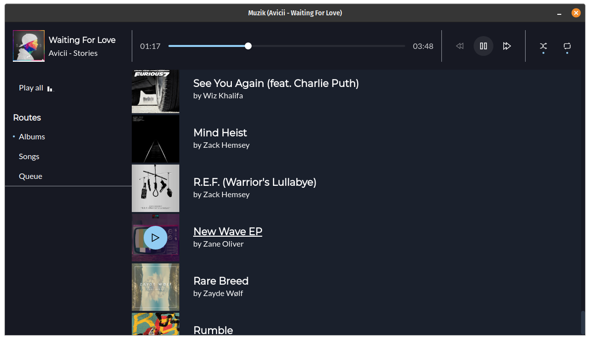

# Muzik



Muzik is an offline music playing app. It currently supports the features most people need out of a music player (i.e. it can play music and has shuffle and repeat modes), but also comes with a clean UI to boot.

There are more features that are planned or in the pipeline:

- Playlists (user-created and automatically generated)
- Rating
- Full screen "kiosk mode"

## Building

After you've cloned the app, run `pnpm i` in the root directory to install the dependencies, then `pnpm run r:build`, which will build the app and output the installers in `apps/desktop/dist`.

Note that currently cross-platform builds are not supported, due to some native dependencies.

## Development

The project is structured as a monorepo, with its dependencies in the `libs` directory and the actual app in `apps`. The only library inside `config` is configuration for Rollup, which isn't used any more.

To start developing, you need to run two commands in different terminals:

In the root directory, run:

```sh
pnpm run r:build:watch
```

This will build all the dependencies that are used by the app, and watches for changes to rebuild.

Inside `apps/desktop`, run:

```sh
pnpm start
```

This will start the dev mode of the application. Note that dev mode does not currently support hot reloading - if you make changes to renderer code, you will need to refresh after it builds, and if you change code that runs on the main process, you will need to stop and restart the application.
